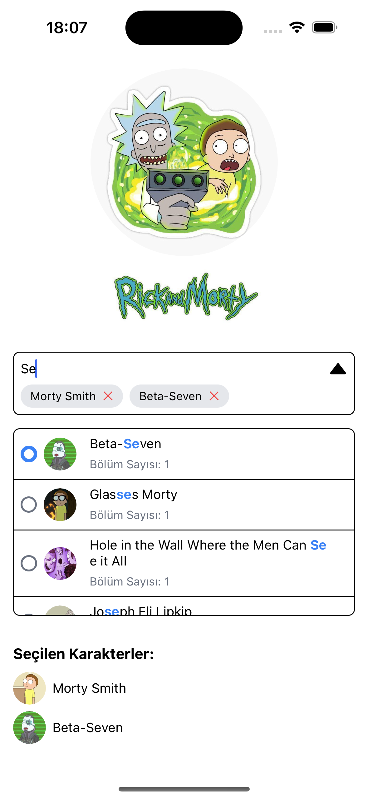

## Rick and Morty MultiSelect Autocomplete


### **Description**

Bu özellik, kullanıcıların bir arama kutusuna karakter isimlerini yazarak, listeyi dinamik olarak filtrelemelerini sağlar. Kullanıcılar arama sonuçlarından bir veya birden fazla karakter seçebilir ve seçilen karakterler, etkileşimli olarak etiketler (tags) halinde arama kutusunun içinde görüntülenir. Her bir etiket, kullanıcı tarafından kaldırılabilir.

### **Use Case**

#### **Kullanıcı Senaryosu**

1. **Kullanıcı Arama Yapmak İster:**  
   Kullanıcı arama kutusuna karakter ismi yazdıkça, sistem API'den karakter verilerini çeker ve kullanıcının arama sorgusuna uygun sonuçları dinamik olarak gösterir.

2. **Kullanıcı Karakter Seçer:**  
   Kullanıcı, arama sonuçlarından bir veya daha fazla karakteri seçebilir. Seçilen karakterler, etkileşimli etiketler olarak görüntülenir. Kullanıcı etiketlere tıklayarak seçimi kaldırabilir.

3. **Kullanıcı Seçilen Karakterleri Görüntüler:**  
   Seçilen karakterlerin isimleri, arama kutusunda etiket olarak gösterilir. Kullanıcı, etiketlere tıklayarak seçimlerini kaldırabilir.

4. **Kullanıcı Aramayı Temizler:**  
   Arama kutusuna yeni bir sorgu girildiğinde, mevcut arama sonuçları ve seçilen karakterler temizlenir ve yeni sonuçlar görüntülenir.

#### **Uygulama Adımları:**

1. Kullanıcı arama kutusuna karakter ismi yazmaya başlar.
2. API'den gelen sonuçlar, filtrelenerek arama kutusunun alt kısmında listelenir.
3. Kullanıcı, arama sonuçlarından karakterleri seçer. Seçilen karakterler, arama kutusunda etiket olarak görünür.
4. Kullanıcı bir etikete tıkladığında, karakterin seçimi kaldırılır.
5. Seçilen karakterler etiket olarak sürekli görüntülenir ve kaldırılabilir.

### **Features**

- **Dinamik Arama:** Kullanıcı arama sorgusunu yazarken sonuçlar anında filtrelenir.
- **Multi-Select:** Kullanıcı birden fazla karakteri seçebilir.
- **Interaktif Etiketler:** Seçilen karakterler etiket olarak görüntülenir ve kullanıcılar etiketleri kaldırabilir.
- **Hata ve Yükleniyor Durumu:** Uygulama, veri çekme sırasında hata mesajları ve yükleniyor durumunu gösterir.
- **Responsive:** Arama kutusu ve etiketler, mobil cihazlarda ve masaüstü cihazlarda uyumlu bir şekilde çalışır.

### **Installation**

1. Projeyi klonlayın:
    ```bash
    git clone https://github.com/serkan-korkac/rick-and-morty-multi-select
    ```

2. Bağımlılıkları yükleyin:
    ```bash
    npm install
    ```

3. Uygulamayı başlatın:
    ```bash
    npm start
    ```

### **How to Use**

1. **Arama Kutusu Kullanımı:**
   - Karakter ismi yazarak arama yapın.
   - İlgili karakteri seçmek için üzerine tıklayın.
   - Seçilen karakter, etiket olarak arama kutusunda gösterilecektir.
   - Etiketler üzerine tıklayarak seçilen karakteri kaldırabilirsiniz.

2. **Multi-Select:**
   - Birden fazla karakteri aynı anda seçebilirsiniz.
   - Seçilen her karakter, ayrı bir etiket olarak görüntülenir.

### **Example Screenshot**
Aşağıda, uygulamanın karakter arama ve seçim ekranına dair bir örnek görsel yer almaktadır:


---

### **Development Notes**

- **API Bağlantısı:**  
  API üzerinden karakter verileri çekilir. API bağlantısı başarılı bir şekilde sağlanamazsa, hata mesajı gösterilir. API teknolojileri tanstack/react-query ve axios.

- **State Management:**  
  Zustand kullanılarak seçilen karakterlerin durumu yönetilmektedir.

- **UI Library:**  
  NativeWind ile stilizasyon yapılmıştır. Kullanıcı dostu bir arayüz sunmak amacıyla esnek ve responsive bir tasarım kullanılmıştır.

- **Android Çıktısı (APK):**  
   /outputs klasörü altında listelenmiştir.